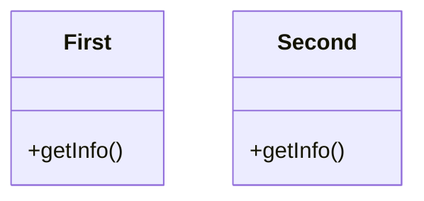

# Modules and Packages with Java SE 11

<!-- START doctoc -->
**Table of Contents**

  - [Diagram of the application](#diagram-of-the-application)
  - [Build](#build)
  - [Run](#run)
  - [License](#license)

<!-- END doctoc -->

## Diagram of the application



## Build

```bash
sh build.sh
```


## Run

```bash
java -p target -m thesecond/com.sandersgutierrez.second.Second
```

## License

This project is [MIT licensed](LICENSE).
